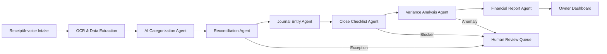

# redevops.io: Agentic Bookkeeping & Accounting

Open-source (AGPL), self-hostable agentic accounting platform with automated month-end close.

## Pain → Legacy → redevops

### The SME Pain
SME owners face persistent accounting challenges that directly impact business viability:
- **Median close time:** 6.4 calendar days (APQC Benchmarks, 2025)
- **Without automation:** 14 calendar days — "two full weeks of making strategic decisions with data that's perpetually half a month out of date"
- **Cash flow & timing pressure:** "Every penny counts" for growing businesses; delayed payments, unforeseen spending, and higher loan amounts "drastically impact financial standing unless managed efficiently"
- **Pricing creep and lock-in:** QuickBooks/Xero pricing creep; "Medium difficulty, 4-8 hours estimated time" even for basic Xero-to-QuickBooks migration

### Why Legacy Fails
- **QuickBooks Online:** Pricing creep and vendor lock-in; "QuickBooks isn't the only solution... alternatives available for lower cost"
- **Xero:** Similar lock-in and migration friction
- **SAP Business One:** "It's designed to be deliberately complicated so that you end up paying money on training, consultants and the like. Once you're in you're stuck with it"
- **Traditional bookkeepers:** Manual processes leading to the 14-day close without automation

### The redevops Answer
Open-source (AGPL), self-hostable agentic accounting platform delivering automated month-end close via open-core ERP + agent layer.

## Value Props
- Self-hosting / data ownership
- No per-seat pricing creep
- Automated month-end close
- No vendor lock-in / plain-text Git-native ledgers

## What It Does & Architecture

### OSS Core
- **ERPNext** + **Beancount** (Frappe Books as lightweight alternative)
- Git-native plain-text ledgers (Beancount)
- AGPL open-source, self-hostable

### Agent Layer
The agent workflow automates the month-end close:



**Pipeline:** OCR/Extraction → Categorization → Reconciliation → Journal Entry → Close Checklist → Variance Analysis → Financial Report, with a Human Review Queue for exceptions.

Agents handle transaction matching & bank reconciliation, automated categorization, variance detection, and accelerate month-end close (e.g., compressing 10 days to 3).

## Quickstart

See `docker-compose.yml` / install instructions and `.env.example` for configuration.

```bash
docker compose up -d
```