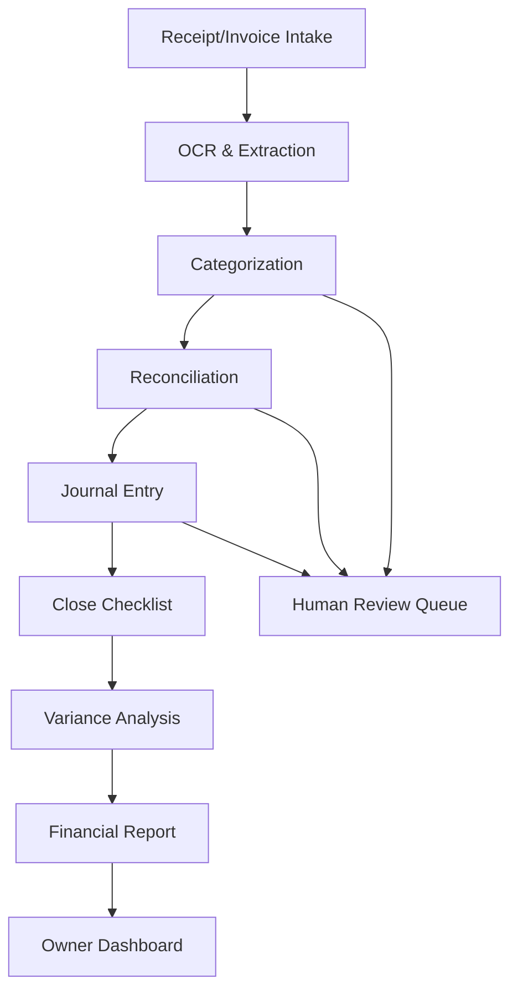

# Architecture

## OSS Core
- **ERPNext**: Provides ERP/accounting backend.
- **Beancount**: Plain-text Git-native double-entry ledger.
- **Frappe Books**: Desktop/mobile note.

## Agent Layer Pipeline
Receipt/Invoice Intake → OCR & Extraction → Categorization → Reconciliation → Journal Entry → Close Checklist → Variance Analysis → Financial Report → Owner Dashboard

With Human Review Queue at critical steps.

## Agent Service
The agent service communicates with ERPNext and Beancount via their respective APIs/clients, and sends LLM calls to the configured OpenAI-compatible endpoint.